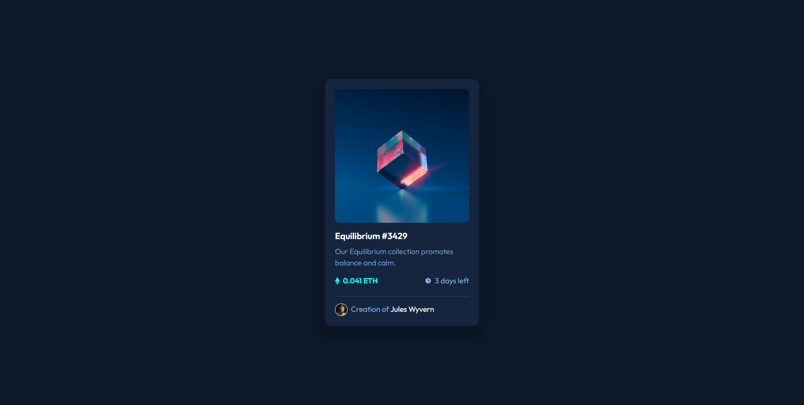

# Frontend Mentor - NFT preview card component solution

This is a solution to the [NFT preview card component challenge on Frontend Mentor](https://www.frontendmentor.io/challenges/nft-preview-card-component-SbdUL_w0U). Frontend Mentor challenges help you improve your coding skills by building realistic projects. 

## Table of contents

- [Frontend Mentor - NFT preview card component solution](#frontend-mentor---nft-preview-card-component-solution)
  - [Table of contents](#table-of-contents)
  - [Overview](#overview)
    - [The challenge](#the-challenge)
    - [Screenshot](#screenshot)
    - [Links](#links)
  - [My process](#my-process)
    - [Built with](#built-with)
    - [What I learned](#what-i-learned)
    - [Continued development](#continued-development)
  - [Author](#author)

## Overview

### The challenge

Users should be able to:

- View the optimal layout depending on their device's screen size
- See hover states for interactive elements

### Screenshot



### Links

- Solution URL: [https://www.frontendmentor.io/challenges/nft-preview-card-component-SbdUL_w0U/hub/nft-card-done-with-vuejs-IDUM2v_ko5](https://www.frontendmentor.io/challenges/nft-preview-card-component-SbdUL_w0U/hub/nft-card-done-with-vuejs-IDUM2v_ko5)
- Live Site URL: [https://illustrious-donut-a7cabf.netlify.app/](https://illustrious-donut-a7cabf.netlify.app/)

## My process

### Built with

- Semantic HTML5 markup
- CSS custom properties
- Flexbox
- [Vue.js](https://vuejs.org/) - Vue Framework
  
### What I learned

- learnt how to overlay a div on an image
  
```html
<div class="wrapper" @mouseover="monkey = true" @mouseleave="monkey = !true">

<div class="overlay" v-if="monkey">

</div>
</div>
```

```css
.wrapper{
  position: relative;
  width: 320px;
  height: 320px;
  display: flex;
  align-items: center;
  justify-content: center;
}
.image{
  position: absolute;
  top: 0;
  left: 0;
  z-index: 1;
}
.overlay{
  position: relative;
  z-index: 10;
  background: hsla(178, 100%, 50%, 0.397);
  width: 320px;
  height: 320px ;
  display: flex;
  align-items: center;
  justify-content: center;
  border-radius: 7px;
}
.overlay img{
  height: 50px;
  width: auto;
}
```

### Continued development

- needs a bit of responsiveness


## Author

- Website - [Joshua Steed](https://www.joshuasteed.com)
- Frontend Mentor - [@0xjoshva](https://www.frontendmentor.io/profile/0xjoshva)